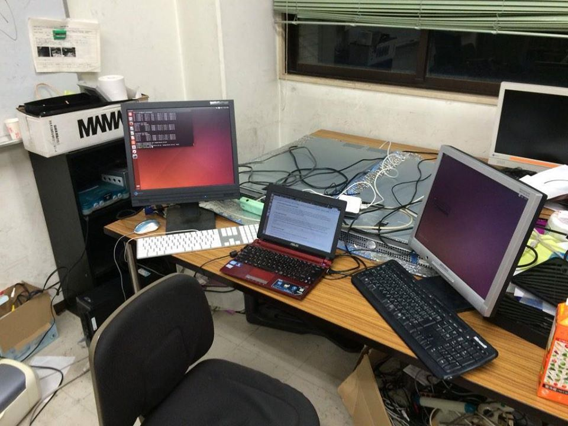

# 陣内　佑 (Yuu Jinnai)

- Email: ddyuudd [at] gmail [dot] com

## 研究分野

自動診断支援、医用画像処理、人工知能、強化学習、プランニング、グラフ探索、並列探索アルゴリズム

## ブックチャプター

- Fukunaga A, Botea A, Jinnai Y, Kishimoto A. 2018. Parallel A* for State-Space Search. Handbook of Parallel Constraint Reasoning, Youssef Hamadi, Lakhdar Sais (eds.), Springer. ISBN 978-3-319-63515-6.  
[BOOK](https://www.springer.com/us/book/9783319635156).

## ジャーナル論文

- Jinnai Y, Fukunaga A. 2017. On Hash-Based Work Distribution Methods for Parallel Best-First Search. Journal of Artificial Intelligence Research (JAIR).  
[PAPER](https://arxiv.org/abs/1706.03254)

## 国際会議論文

- Lecarpentier E, Abel D, Asadi K, Jinnai Y, Rachelson E, Littman Michael L. 2021. Lipschitz Lifelong Reinforcement Learning. Proc. 35th AAAI conference on Artificial Intelligence (AAAI-21)  
[PAPER](https://arxiv.org/abs/2001.05411) [POSTER](../pdf/posters/AAAI-2021 poster.pdf) [CODE](https://github.com/SuReLI/llrl)

- Y. Jinnai, J. Park, M.C. Machado, and G.D. Konidaris. Exploration in Reinforcement Learning with Deep Covering Options. Accepted, Proceedings of the Eighth International Conference on Learning Representations. (ICLR-20)  
[PAPER](../pdf/papers/ICLR-20.pdf)

- Wang L\*, Zhao Y\*, Jinnai Y, Tian Y, Fonseca R. 2020. AlphaX: eXploring Neural Architectures with Deep Neural Networks and Monte Carlo Tree Search. Proc. 34th AAAI conference on Artificial Intelligence (AAAI-20) \*These authors contributed equally to this work.  
[PAPER](https://arxiv.org/abs/1903.11059) [CODE](https://github.com/linnanwang/AlphaX-NASBench101)

- Jinnai Y. Park JW, Abel D, Konidaris G. 2019. Discovering Options for Exploration by Minimizing Cover Time. Proc. 36th International Conference on Machine Learning. (ICML-19)  
[PAPER](../pdf/papers/ICML-19-rl.pdf) [CODE](https://github.com/jinnaiyuu/Optimal-Options-ICML-2019)

- Jinnai Y, Abel D, Hershkowitz E, Littman M, Konidaris G. 2018. Finding Options that Minimize Planning Time. Proc. 36th International Conference on Machine Learning. (ICML-19)  
[PAPER](../pdf/papers/ICML-19-plan.pdf) [CODE](https://github.com/jinnaiyuu/Optimal-Options-ICML-2019)

- Abel D, Arumugam D, Asadi K, Jinnai Y, Littman M, Wong L, 2019. State Abstraction as Compression in Apprenticeship Learning. Proc. 33rd AAAI Conference on Artificial Intelligence (AAAI-19).  
[PAPER](../pdf/papers/AAAI-19.pdf)

- Abel D\*, Jinnai Y\*, Guo Y, Konidaris G, Littman M. 2018. Policy and Value Transfer for Lifelong Reinforcement Learning. Proc. 35th International Conference on Machine Learning. \*These authors contributed equally to this work.  
[PAPER](../pdf/papers/ICML-18.pdf) [POSTER](../pdf/posters/NEML-18 poster.pdf)  [CODE](https://github.com/david-abel/transfer_rl_icml_2018)

- Jinnai Y, Fukunaga A. 2017. Learning to Prune Dominated Action Sequences in Online Black-box Planning. Proc. 31st AAAI Conference on Artificial Intelligence (AAAI-17)  
[PAPER](../pdf/papers/AAAI-17 Jinnai-Fukunaga.pdf) [SLIDES](../pdf/slides/AAAI-17 slides.pdf) [CODE](https://github.com/jinnaiyuu/Atari-iterative-width)

- Jinnai Y, Fukunaga A. 2016. Automated Creation of Efficient Work Distribution Functions for Parallel Best-First Search. Proc. 19th International Conference on Automated Planning and Scheduling (ICAPS-16)  
[PAPER](../pdf/papers/ICAPS-16 Jinnai-Fukunaga.pdf) [SLIDES](../pdf/slides/ICAPS-16 slides.pdf) [VIDEO](https://youtu.be/x2mjIOkLQxw?t=42m57s)

- Jinnai Y, Fukunaga A. 2016. Abstract Zobrist Hashing: An Efficient Work Distribution Method for Parallel Best-First Search. Proc. 30th AAAI Conference on Artificial Intelligence (AAAI-16)  
[PAPER](../pdf/papers/AAAI-16 Jinnai-Fukunaga.pdf) [POSTER](../pdf/posters/AAAI-16 poster.pdf)

## 国際会議ワークショップ論文

- Jinnai Y, Abel D, Park JW, Hershkowitz DE, Littman M, Konidaris G. 2019. Skill Discovery with Well-Defined Objectives. ICLR Worshop on Structure and Priors in Reinforcement Learning.  
[PAPER](../pdf/papers/SPiRL-19.pdf)

- Jinnai Y, Fukunaga A. 2017. A Graph-Partitioning Based Approach for Parallel Best-First Search. ICAPS 2017 Workshop on Heuristic and Search for Domain-Independent Planning (HSDIP). This paper summarizes work which will appear in a JAIR article.  
[PAPER](../pdf/papers/HSDIP-17 Jinnai-Fukunaga.pdf) [SLIDES](../pdf/slides/AAAI-17 slides.pdf) [POSTER](../pdf/posters/ICAPS-17 poster.pdf)

## プリプリント

- Fukunaga A., Botea A, Jinnai Y., Kishimoto A. 2017. A Survey of Parallel A*. arXiv 1708.05296  
[PAPER](https://arxiv.org/abs/1708.05296)

## 研究発表

- リングエコーにおける深層学習による腫瘍の自動検出. K. Madhawa, Y. Jinnai, M. Suzuki, T. Azuma, S. Akashi-Tanaka, T. Doi. [第32回日本乳癌検診学会学術総会](https://convention.jtbcom.co.jp/jabcs2022/) (2022/11)
- リングエコーにおける深層学習を用いた乳腺比率測定. S. Fukagawa, Y. Jinnai, K. Madhawa, T. Azuma, M. Suzuki, N. Tomii, S. Akashi-Tanaka, T. Doi. [第32回日本乳癌検診学会学術総会](https://convention.jtbcom.co.jp/jabcs2022/) (2022/11)
- Deep learning-based model for tumor detection in ultrasound computed tomography. K. Madhawa, Y. Jinnai, M. Suzuki, T. Azuma, S. Akashi-Tanaka, T. Doi. [Computer Assisted Radiology and Surgery Proceedings of the 36th International Congress and Exhibition](https://www.cars-int.org/) (2022/6)
- Automated Breast Density Assessment using B-mode Ultrasound Computed Tomography. S. Fukagawa, Y. Jinnai, K. Madhawa, T. Azuma, M. Suzuki, N. Tomii, S. Akashi-Tanaka, T. Doi. [Computer Assisted Radiology and Surgery Proceedings of the 36th International Congress and Exhibition](https://www.cars-int.org/) (2022/6)
- Motion Artifact Correction for Ultrasound Computed Tomography. Y. Tanaka, Y. Jinnai, T. Azuma, S. Akashi-Tanaka, T. Doi. [Computer Assisted Radiology and Surgery Proceedings of the 36th International Congress and Exhibition](https://www.cars-int.org/) (2022/6)
- Automated Tumor Feature Classification Method for Ultrasound Computed Tomography
T. Koike, Y. Jinnai, K. Madhawa, T. Azuma, M. Suzuki, N. Tomii, S. Akashi-Tanaka, T. Doi, [Computer Assisted Radiology and Surgery Proceedings of the 36th International Congress and Exhibition](https://www.cars-int.org/) (2022/6)
- リングエコーにおける深層学習による腫瘤の自動検出. K. Madhawa, Y. Jinnai, M. Suzuki, T. Azuma, S. Akashi-Tanaka, T. Doi. [日本超音波医学会第95回学術集会](https://www.congre.co.jp/jsum95/) (2022/5)
- Jinnai Y., Fukunaga A.: Learning to Prune Dominated Action Sequences in Online Black-box Planning, [第102回人工知能基礎問題研究会](https://sig-fpai.org/past/fpai102.html), JR博多シティ (2017/12)
- 陣内佑, 福永Alex: グラフ分割による並列探索の為の効率的な仕事分配手法, 第30回人工知能学会全国大会, 北九州国際会議場 (2016/6)
- 陣内佑, 福永Alex: Structured Zobrist Hashによる効率的な並列最良優先探索, 第29回人工知能学会全国大会, 公立はこだて未来大学 (2015/6)

## 学会活動 

- 2017年度　第31回人工知能学会全国大会 [学生プログラム委員](http://www.ai-gakkai.or.jp/jsai2017/student/)
- 2016年度　第30回人工知能学会全国大会 [学生プログラム委員](http://www.ai-gakkai.or.jp/jsai2016/student/)

## 研究助成

- 2022年 東京工業大学学術国際情報センター[TSUBAME共同利用](https://www.gsic.titech.ac.jp/node/60#adoption_r04_s1) (産業利用)
- 2017年 東京大学大学院総合文化研究科 [広域科学専攻　国際研究集会出席者資金助成](https://system.c.u-tokyo.ac.jp/p-graduate/wakate-report.html) [報告書](https://system.c.u-tokyo.ac.jp/p-graduate/wakate-reports/AAAI17-jinnai.pdf) (AAAI-17)
- 2016年 東京大学情報基盤センタースーパーコンピューティング部門 若手・女性利用 (学際大規模共同利用・共同研究拠点（JHPCN） 萌芽型共同研究課題)  
[成果レポート](../pdf/papers/supercomputing.pdf)
- 2016年 [財団法人 NEC C&C財団](https://www.candc.or.jp/index.html)　国際会議論文発表者助成 (ICAPS-16)
- 2016年 東京大学大学院総合文化研究科 [広域科学専攻　国際研究集会出席者資金助成](https://system.c.u-tokyo.ac.jp/p-graduate/wakate-report.html) (AAAI-16)

## 学位論文

- 修士  
Jinnai Y. 2017. On Hash-Based Work Distribution Methods for Parallel Best-First Search. Thesis Advisor: Alex Fukunaga. University of Tokyo. [PAPER](../pdf/papers/MasterThesis.pdf)

- 学士  
陣内 佑, マルチコアマシンにおける並列A*探索の探索オーバーヘッドの解析とアルゴリズムの再評価 (2014) (指導教官: [福永 Alex](http://metahack.org/index.html))

## ティーチング

- [強化学習 (第2版)](https://www.morikita.co.jp/books/mid/082662)  
強化学習 (第2版)を共訳しました。なお、[英語の原著は無料で公開されています](http://incompleteideas.net/book/the-book-2nd.html)。
強化学習を専門として学ぶ方は原著も読むと良いと思っています。

- [ヒューリスティック探索](../pdf/textbook.pdf)  
ヒューリスティック探索の日本語の文献がないので入門書を日本語で書いています。

- [みんなのデータ構造](https://www.lambdanote.com/products/opendatastructures)  
みんなのデータ構造はPat Morin教授が執筆しオープンソース(CC BY)で公開されているデータ構造の入門教科書[Open Data Structures](http://opendatastructures.org/)を日本語に翻訳したものです。
日本語版の書籍そのものはCC BYライセンスではありませんが、[原稿テキストおよび原稿のPDFをGithubでCC BYで公開しています](https://github.com/spinute/ods)  (レイアウト・スタイルは書籍版と異なります)。  
[BOOK](../pdf/ods-cpp.pdf)

- 2016年度冬学期 (東京大学)  
TA: 寺子屋 (学際科学科に進学する文科出身の２年生の数学のフォローアップをするプログラム)

- 2016年度夏学期 (東京大学)  
TA: 情報工学実験

- 2015年度 (東京都立多摩科学技術高校)  
東京都立多摩科学技術高校にて非常勤講師。スーパーサイエンスハイスクール (SSH)事業の一環として海外での科学技術シンボジウム(Global Science Link)での研究発表を行う高校生に研究発表の準備のためのポスター作成、口頭発表方法を教えました。

- 2015年度冬学期 (東京大学)  
TA: 寺子屋 (学際科学科に進学する文科出身の２年生の数学のフォローアップをするプログラム)

- 2015年度夏学期 (東京大学)  
TA: 理科生のための初年次ゼミナール  
TA: 情報工学実験

## 受賞など

- 2017年3月 [東京大学大学院総合文化研究科 一高記念賞](https://ja.wikipedia.org/wiki/%E4%B8%80%E9%AB%98%E8%A8%98%E5%BF%B5%E8%B3%9E)

## セミナー

- 2022年2月 [NVIDIA Partner Solution Connect](https://events.nvidia.com/nvidiapartnersolutionconnect1). 新しい画像診断機器のための自動診断支援AIの開発. NVIDIA Japan.
- 2018年7月 Automated Deep Learning by Neural Architecture Search. NICT.
- 2017年2月 Graph search algorithms for classical planning. 北海道大学[離散構造処理系プロジェクト](https://www-erato.ist.hokudai.ac.jp/index.php)

## 特許

- 超音波CTのための体動検出と補正 [Google Patents](https://patents.google.com/patent/WO2022114131A1/)
- 信号分離による超音波CTの撮像高速化 [Google Patents](https://patents.google.com/patent/WO2022054848A1/)

## その他

- [映像情報Medical 2022年11月号](https://www.eizojoho.co.jp/publications/1541) 乳房用リング型超音波画像診断装置「COCOLY（ココリー）」と自動診断支援AIの開発.  
- [RadFan 2022年7月号](https://www.e-radfan.com/shop-radfan/93345/) 超音波CTのための自動診断支援AIの開発.  
- Reviewer of International Conference of Machine Learning (2019), Neural Information Processing Systems (2019), AAAI Conference on Artificial Intelligence (2020).
- Reviewer of Journal of Machine Learning Research.
- Reviewer of Journal of Artificial Intelligence Research.
- Reviewer of Knowledge-based Systems
- 2013年9月~2016年8月 Resident assistant for international students at University of Tokyo International lodge, Komaba lodge

- プログラミング言語  
Proficient:  C++, Python 3  
Experienced: C, C#, Objective-C, Rust, Java, Ruby, JavaScript, Common Lisp, Scheme, Haskell, Racket, Prolog, R, bash, gawk, MATLAB, Processing, Lua

- Tools
git, CircleCI, Emacs, Visual Studio Code, AWS, Azure DevOps, weights and biases, GCP, torque job scheduler  

- サーバー構築  
Ubuntuのインストールからはじめてハブを買ってノードをつなげ、NFSを入れたりjob schedulerを設定してしたりしました。  
このサーバーは卒業論文の実験に使いました。当時学部生の私にこの機会をくださった福永先生に感謝します。  

- [Atcoderで緑です](https://atcoder.jp/users/ddyuudd)

## 略歴

- 2020年4月~2023年1月 Research Engineer, Team Leader, Project Manager, Lily MedTech
- 2017年6月~2020年1月 Ph.D. student, Department of Computer Science, Brown University
- 2019年6月~2019年9月 インターン、Microsoft Research Cambridge, UK
- 2017年3月~2017年5月 テクニカルスタッフ、理化学研究所革新知能統合研究センター
- 2015年4月~2017年3月 東京大学大学院総合文化研究科広域科学専攻修士課程
- 2013年8月~2013年12月 The University of British Columbiaへ交換留学 ([先頭の報告書が私のものです](http://www.u-tokyo.ac.jp/content/400007080.pdf))
- 2011年4月~2015年3月 東京大学教養学部学際科学科
- ~2011年3月 筑波大学附属駒場高等学校
