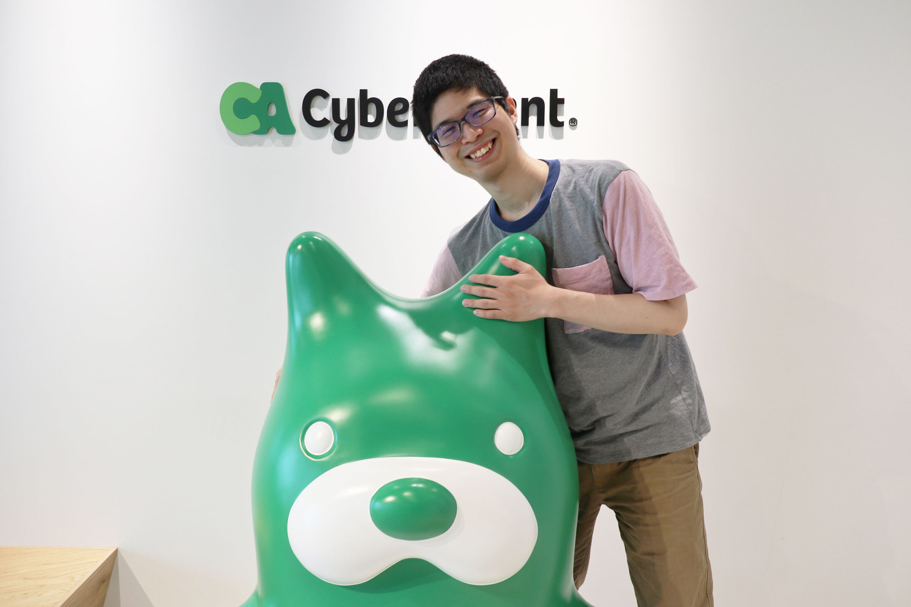

# 陣内　佑 (Yuu Jinnai)

Researcher, CyberAgent AI Lab  

- Email: ddyuudd [at] gmail [dot] com

## 研究分野

人工知能、強化学習、自然言語生成、機械学習、プランニング、グラフ探索、医用画像処理

## ジャーナル論文

- Yuki Ichihara, Yuu Jinnai, Tetsuro Morimura, Kenshi Abe, Kaito Ariu, Mitsuki Sakamoto, Eiji Uchibe. 2025. Evaluation of Best-of-N Sampling Strategies for Language Model Alignment. Transactions on Machine Learning Research (TMLR).  
[PAPER](https://openreview.net/pdf?id=H4S4ETc8c9) [CODE](https://github.com/CyberAgentAILab/srbon) [TALK](https://www.youtube.com/watch?v=2HC6Bqvrdk4)

- Jinnai Y, Fukunaga A. 2017. On Hash-Based Work Distribution Methods for Parallel Best-First Search. Journal of Artificial Intelligence Research (JAIR).  
[PAPER](https://www.jair.org/index.php/jair/article/view/11090) [CODE](https://github.com/jinnaiyuu/distributed-fast-downward)

## 国際会議論文

- Yuki Ichihara, Yuu Jinnai, Kaito Ariu, Tetsuro Morimura, Eiji Uchibe. 2025. Theoretical Guarantees for Minimum Bayes Risk Decoding. Annual Meeting of the Association for Computational Linguistics (ACL-25).  
[PAPER](https://arxiv.org/abs/2502.12685)

- Ayuto Tsutsumi, Yuu Jinnai. 2025. Do Large Language Models Know Folktales? A Case Study of Yokai in Japanese Folktales. In Findings of the Association for Computational Linguistics (ACL-25 Findings).  
[PAPER](https://arxiv.org/abs/2506.03619) [CODE](https://github.com/CyberAgentAILab/YokaiEval) [DATASET](https://huggingface.co/datasets/cyberagent/YokaiEval)

- Yuu Jinnai. 2025. Document-Level Text Generation with Minimum Bayes Risk Decoding using Optimal Transport. Annual Meeting of the Association for Computational Linguistics (ACL-25).  
[PAPER](https://arxiv.org/abs/2505.23078) [CODE](https://github.com/jinnaiyuu/mbr-optimal-transport)

- Yuu Jinnai, Tetsuro Morimura, Kaito Ariu, Kenshi Abe. 2025. Regularized Best-of-N Sampling with Minimum Bayes Risk Objective for Language Model Alignment. North American Chapter of the Association for Computational Linguistics (NAACL-25).  
[PAPER](https://arxiv.org/abs/2404.01054) [CODE](https://github.com/CyberAgentAILab/regularized-bon) [TALK](https://www.youtube.com/watch?v=W7tBJK4n0H8)

- Morimura, T., Sakamoto, M., Jinnai, Y., Abe, K., & Ariu, K. (2024). Filtered Direct Preference Optimization. The 2024 Conference on Empirical Methods in Natural Language Processing. (EMNLP-24)  
[PAPER](https://arxiv.org/abs/2404.13846) [CODE](https://github.com/CyberAgentAILab/filtered-dpo)

- Jinnai Y, Ariu K. Hyperparameter-Free Approach for Faster Minimum Bayes Risk Decoding. In Findings of the Association for Computational Linguistics. (ACL-24 Findings)  
[PAPER](https://arxiv.org/abs/2401.02749) [CODE](https://github.com/CyberAgentAILab/adaptive-mbr) [TALK](https://www.youtube.com/watch?v=iJAGPIMtxC0)
 
- Jinnai Y, Honda U, Morimura T, Zhang P. Generating Diverse and High-Quality Texts by Minimum Bayes Risk Decoding. In Findings of the Association for Computational Linguistics. (ACL-24 Findings)  
[PAPER](https://arxiv.org/abs/2401.05054) [CODE](https://github.com/CyberAgentAILab/diverse-mbr) [TALK](https://www.youtube.com/watch?v=dU7LzgPwANo)

- Jinnai Y, Morimura T, Honda U, Ariu K, Abe K. Model-based minimum bayes risk decoding. Proc. 41st International Conference on Machine Learning. (ICML-24)  
[PAPER](https://arxiv.org/abs/2311.05263) [CODE](https://github.com/CyberAgentAILab/model-based-mbr) [TALK](https://www.youtube.com/watch?v=w8_rLLPkE5A)

- Ohashi A, Honda U, Morimura T, Jinnai Y. 2024. On the True Distribution Approximation of Minimum Bayes-Risk Decoding. In Proceedings of the 2024 Conference of the North American Chapter of the Association for Computational Linguistics. (NAACL-24)  
[PAPER](https://aclanthology.org/2024.naacl-short.38.pdf) [CODE](https://github.com/CyberAgentAILab/mbr-anomaly) [TALK](https://drive.google.com/file/d/1Cf7woqG96NYxQpTU81iRt1Ek8NyCORBP/view?usp=drive_link)

- Lecarpentier E, Abel D, Asadi K, Jinnai Y, Rachelson E, Littman Michael L. 2021. Lipschitz Lifelong Reinforcement Learning. Proc. 35th AAAI conference on Artificial Intelligence. (AAAI-21)  
[PAPER](https://arxiv.org/abs/2001.05411) [POSTER](../pdf/posters/AAAI-2021 poster.pdf) [CODE](https://github.com/SuReLI/llrl)

- Y. Jinnai, J. Park, M.C. Machado, and G.D. Konidaris. Exploration in Reinforcement Learning with Deep Covering Options. Accepted, Proceedings of the Eighth International Conference on Learning Representations. (ICLR-20)  
[PAPER](../pdf/papers/ICLR-20.pdf)

- Wang L\*, Zhao Y\*, Jinnai Y, Tian Y, Fonseca R. 2020. AlphaX: eXploring Neural Architectures with Deep Neural Networks and Monte Carlo Tree Search. Proc. 34th AAAI conference on Artificial Intelligence (AAAI-20) \*These authors contributed equally to this work.  
[PAPER](https://arxiv.org/abs/1903.11059) [CODE](https://github.com/linnanwang/AlphaX-NASBench101)

- Jinnai Y. Park JW, Abel D, Konidaris G. 2019. Discovering Options for Exploration by Minimizing Cover Time. Proc. 36th International Conference on Machine Learning. (ICML-19)  
[PAPER](../pdf/papers/ICML-19-rl.pdf) [CODE](https://github.com/jinnaiyuu/Optimal-Options-ICML-2019)

- Jinnai Y, Abel D, Hershkowitz E, Littman M, Konidaris G. 2018. Finding Options that Minimize Planning Time. Proc. 36th International Conference on Machine Learning. (ICML-19)  
[PAPER](../pdf/papers/ICML-19-plan.pdf) [CODE](https://github.com/jinnaiyuu/Optimal-Options-ICML-2019)

- Abel D, Arumugam D, Asadi K, Jinnai Y, Littman M, Wong L, 2019. State Abstraction as Compression in Apprenticeship Learning. Proc. 33rd AAAI Conference on Artificial Intelligence (AAAI-19).  
[PAPER](../pdf/papers/AAAI-19.pdf)

- Abel D\*, Jinnai Y\*, Guo Y, Konidaris G, Littman M. 2018. Policy and Value Transfer for Lifelong Reinforcement Learning. Proc. 35th International Conference on Machine Learning. \*These authors contributed equally to this work.  
[PAPER](../pdf/papers/ICML-18.pdf) [POSTER](../pdf/posters/NEML-18 poster.pdf)  [CODE](https://github.com/david-abel/transfer_rl_icml_2018)

- Jinnai Y, Fukunaga A. 2017. Learning to Prune Dominated Action Sequences in Online Black-box Planning. Proc. 31st AAAI Conference on Artificial Intelligence (AAAI-17)  
[PAPER](../pdf/papers/AAAI-17 Jinnai-Fukunaga.pdf) [SLIDES](../pdf/slides/AAAI-17 slides.pdf) [CODE](https://github.com/jinnaiyuu/Atari-iterative-width)

- Jinnai Y, Fukunaga A. 2016. Automated Creation of Efficient Work Distribution Functions for Parallel Best-First Search. Proc. 19th International Conference on Automated Planning and Scheduling (ICAPS-16)  
[PAPER](../pdf/papers/ICAPS-16 Jinnai-Fukunaga.pdf) [SLIDES](../pdf/slides/ICAPS-16 slides.pdf) [VIDEO](https://youtu.be/x2mjIOkLQxw?t=42m57s)

- Jinnai Y, Fukunaga A. 2016. Abstract Zobrist Hashing: An Efficient Work Distribution Method for Parallel Best-First Search. Proc. 30th AAAI Conference on Artificial Intelligence (AAAI-16)  
[PAPER](../pdf/papers/AAAI-16 Jinnai-Fukunaga.pdf) [POSTER](../pdf/posters/AAAI-16 poster.pdf)

## 国際会議ワークショップ論文

- Jinnai Y. 2024. Does Cross-Cultural Alignment Change the Commonsense Morality of Language Models? The 2nd Workshop on Cross-Cultural Considerations in NLP (C3NLP Workshop at ACL 2024). **Best Paper Award**.  
[PAPER](https://aclanthology.org/2024.c3nlp-1.5.pdf) [TALK](https://www.youtube.com/watch?v=TjFDn3L65s0) [MODEL](https://huggingface.co/cyberagent/calm2-7b-chat-dpo-experimental) [DATASET](https://huggingface.co/datasets/cyberagent/chatbot-arena-ja-calm2-7b-chat-experimental)

- Morimura T, Sakamoto M, Jinnai Y, Abe K, Ariu K. 2024. Filtered Direct Preference Optimization. ICML 2024 Workshop on Models of Human Feedback for AI Alignment.  
[PAPER](https://arxiv.org/abs/2404.13846) [CODE](https://github.com/CyberAgentAILab/filtered-dpo)

- Jinnai Y, Morimura T, Ariu K, Abe K. 2024. Regularized Best-of-N Sampling to Mitigate Reward Hacking for Language Model Alignment. ICML 2024 Workshop on Models of Human Feedback for AI Alignment.  
[PAPER](https://arxiv.org/abs/2404.01054) [CODE](https://github.com/CyberAgentAILab/regularized-bon)

- Jinnai Y, Abel D, Park JW, Hershkowitz DE, Littman M, Konidaris G. 2019. Skill Discovery with Well-Defined Objectives. ICLR Worshop on Structure and Priors in Reinforcement Learning.  
[PAPER](../pdf/papers/SPiRL-19.pdf)

- Jinnai Y, Fukunaga A. 2017. A Graph-Partitioning Based Approach for Parallel Best-First Search. ICAPS 2017 Workshop on Heuristic and Search for Domain-Independent Planning (HSDIP).  
[PAPER](../pdf/papers/HSDIP-17 Jinnai-Fukunaga.pdf) [SLIDES](../pdf/slides/HSDIP-17 slides.pdf)  

## ブックチャプター

- Fukunaga A, Botea A, Jinnai Y, Kishimoto A. 2018. Parallel A* for State-Space Search. Handbook of Parallel Constraint Reasoning, Youssef Hamadi, Lakhdar Sais (eds.), Springer. ISBN 978-3-319-63515-6.  
[BOOK](https://www.springer.com/us/book/9783319635156).

## プリプリント

- Jinnai Y, Honda U. 2024. Annotation-Efficient Preference Optimization for Language Model Alignment arXiv preprint arXiv:2405.13541.  
[PAPER](https://arxiv.org/abs/2405.13541)
- Jinnai Y., Morimura T., Honda U. 2023. On the Depth between Beam Search and Exhaustive Search for Text Generation. arXiv 2308.13696  
[PAPER](https://arxiv.org/abs/2308.13696)
- Noda T, Jinnai Y, Tomii N, Azuma T. 2023. Blind Signal Separation for Fast Ultrasound Computed Tomography. arXiv 2304.14424  
[PAPER](https://arxiv.org/abs/2304.14424) 
- Fukunaga A., Botea A, Jinnai Y., Kishimoto A. 2017. A Survey of Parallel A*. arXiv 1708.05296  
[PAPER](https://arxiv.org/abs/1708.05296)

## ソフトウェア

- [calm2-7b-chat-dpo](https://huggingface.co/cyberagent/calm2-7b-chat-dpo-experimental): Direct Preference Optimizationによってチューニングを行った日本語LLM  

## 研究発表

- 市原有生希, 陣内佑, 蟻生開人, 森村哲郎, 内部英治. テキスト生成における最小ベイズリスク復号の理論的な理解に向けて. 言語処理学会第31回年次大会(NLP2025) (2025/3) [**優秀賞**](https://anlp.jp/nlp2025/award.html)
- 堤歩斗, 陣内佑. LLM は日本の民話を知っているか？ 妖怪知識評価データセットの構築へ向けて. 言語処理学会第31回年次大会(NLP2025) (2025/3)
- 坂本充生, 陣内佑, 森村哲郎, 阿部拳之, 蟻生開人. 大規模言語モデルのためのアライメントデータ合成手法の実験的評価. 言語処理学会第31回年次大会(NLP2025) (2025/3)
- 森村哲郎, 坂本充生, 陣内佑, 阿部拳之, 蟻生開人. ベイズリスク選好最適化：報酬モデル不要のオンライン選好最適化手法. 第27回情報論的学習理論ワークショップ (IBIS2024) (2024/11)
- 市原有生希, 陣内佑, 森村哲郎, 阿部拳之, 蟻生開人, 坂本充生, 内部英治. Evaluation of Best-of-N Sampling Strategies for Language Model Alignment. 第27回情報論的学習理論ワークショップ (IBIS2024) (2024/11)
- 坂本充生, 森村哲郎, 陣内佑, 阿部拳之, 蟻生開人. Filtered Direct Preference Optimization: 選好データセットの質に基づくフィルタリング手法の提案. 第19回言語処理若手シンポジウム（YANS）(2024/5)
- 陣内佑. 英語データセットを使ったRLHFは日本語LLMの常識道徳にどのような影響を与えるか？ 第19回言語処理若手シンポジウム（YANS）(2024/5)
- 陣内佑, 森村哲郎, 本多右京. Decoding with Semi-Local Constraint on Information Density.  第18回言語処理若手シンポジウム（YANS）(2023/6)
- リングエコーにおける深層学習による腫瘍の自動検出. K. Madhawa, Y. Jinnai, M. Suzuki, T. Azuma, S. Akashi-Tanaka, T. Doi. [第32回日本乳癌検診学会学術総会](https://convention.jtbcom.co.jp/jabcs2022/) (2022/11)
- リングエコーにおける深層学習を用いた乳腺比率測定. S. Fukagawa, Y. Jinnai, K. Madhawa, T. Azuma, M. Suzuki, N. Tomii, S. Akashi-Tanaka, T. Doi. [第32回日本乳癌検診学会学術総会](https://convention.jtbcom.co.jp/jabcs2022/) (2022/11)
- Deep learning-based model for tumor detection in ultrasound computed tomography. K. Madhawa, Y. Jinnai, M. Suzuki, T. Azuma, S. Akashi-Tanaka, T. Doi. [Computer Assisted Radiology and Surgery Proceedings of the 36th International Congress and Exhibition](https://www.cars-int.org/) (2022/6)
- Automated Breast Density Assessment using B-mode Ultrasound Computed Tomography. S. Fukagawa, Y. Jinnai, K. Madhawa, T. Azuma, M. Suzuki, N. Tomii, S. Akashi-Tanaka, T. Doi. [Computer Assisted Radiology and Surgery Proceedings of the 36th International Congress and Exhibition](https://www.cars-int.org/) (2022/6)
- Motion Artifact Correction for Ultrasound Computed Tomography. Y. Tanaka, Y. Jinnai, T. Azuma, S. Akashi-Tanaka, T. Doi. [Computer Assisted Radiology and Surgery Proceedings of the 36th International Congress and Exhibition](https://www.cars-int.org/) (2022/6)
- Automated Tumor Feature Classification Method for Ultrasound Computed Tomography
T. Koike, Y. Jinnai, K. Madhawa, T. Azuma, M. Suzuki, N. Tomii, S. Akashi-Tanaka, T. Doi, [Computer Assisted Radiology and Surgery Proceedings of the 36th International Congress and Exhibition](https://www.cars-int.org/) (2022/6)
- リングエコーにおける深層学習による腫瘤の自動検出. K. Madhawa, Y. Jinnai, M. Suzuki, T. Azuma, S. Akashi-Tanaka, T. Doi. [日本超音波医学会第95回学術集会](https://www.congre.co.jp/jsum95/) (2022/5)
- Jinnai Y., Fukunaga A.: Learning to Prune Dominated Action Sequences in Online Black-box Planning, [第102回人工知能基礎問題研究会](https://sig-fpai.org/past/fpai102.html), JR博多シティ (2017/12)
- 陣内佑, 福永Alex: グラフ分割による並列探索の為の効率的な仕事分配手法, 第30回人工知能学会全国大会, 北九州国際会議場 (2016/6)
- 陣内佑, 福永Alex: Structured Zobrist Hashによる効率的な並列最良優先探索, 第29回人工知能学会全国大会, 公立はこだて未来大学 (2015/6)

## 研究助成・奨学金

- 2022年 東京工業大学学術国際情報センターTSUBAME共同利用 産業利用（成果公開） [報告書](https://www.gsic.titech.ac.jp/node/1113)
- 2017年 東京大学大学院総合文化研究科 [広域科学専攻　国際研究集会出席者資金助成](https://system.c.u-tokyo.ac.jp/p-graduate/wakate-report.html) [報告書](https://system.c.u-tokyo.ac.jp/p-graduate/wakate-reports/AAAI17-jinnai.pdf) (AAAI-17)
- 2016年 東京大学情報基盤センタースーパーコンピューティング部門 若手・女性利用 (学際大規模共同利用・共同研究拠点（JHPCN） 萌芽型共同研究課題)  
[成果レポート](../pdf/papers/supercomputing.pdf)
- 2016年 [財団法人 NEC C&C財団](https://www.candc.or.jp/index.html)　国際会議論文発表者助成 (ICAPS-16)
- 2016年 東京大学大学院総合文化研究科 [広域科学専攻　国際研究集会出席者資金助成](https://system.c.u-tokyo.ac.jp/p-graduate/wakate-report.html) (AAAI-16)

## 書籍  

- [ヒューリスティック探索 合理的なAIをつくるためのアルゴリズム](https://www.amazon.co.jp/dp/4065392187)  
ヒューリスティック探索の教科書です。日本語で書かれたヒューリスティック探索の書籍がなかったので書きました。  
主に大学生・大学院生を想定して書いています。基礎的な理論に加え疑似コードとPython 3実装を載せており、実践的な内容になっております。

- [強化学習 (第2版)](https://www.morikita.co.jp/books/mid/082662)  
強化学習 (第2版)を共訳しました。なお、[英語の原著は無料で公開されています](http://incompleteideas.net/book/the-book-2nd.html)。
強化学習を専門として学ぶ方は原著も読むと良いと思っています。

- [みんなのデータ構造](https://www.lambdanote.com/products/opendatastructures)  
みんなのデータ構造はPat Morin教授が執筆しオープンソース(CC BY)で公開されているデータ構造の入門教科書[Open Data Structures](http://opendatastructures.org/)を日本語に翻訳したものです。
日本語版の書籍そのものはCC BYライセンスではありませんが、[原稿テキストおよび原稿のPDFをGithubでCC BYで公開しています](https://github.com/spinute/ods)  (レイアウト・スタイルは書籍版と異なります)。  
[BOOK](../pdf/ods-cpp.pdf)

## ティーチング  

- 2016年度冬学期 (東京大学)  
TA: 寺子屋 (学際科学科に進学する文科出身の２年生の数学のフォローアップをするプログラム)

- 2016年度夏学期 (東京大学)  
TA: 情報工学実験

- 2015年度 (東京都立多摩科学技術高校)  
東京都立多摩科学技術高校にて非常勤講師。スーパーサイエンスハイスクール (SSH) 事業の一環として海外での科学技術シンボジウム (Global Science Link) での研究発表を行う高校生に研究発表の準備のためのポスター作成、口頭発表方法を教えました。

- 2015年度冬学期 (東京大学)  
TA: 寺子屋 (学際科学科に進学する文科出身の２年生の数学のフォローアップをするプログラム)

- 2015年度夏学期 (東京大学)  
TA: 理科生のための初年次ゼミナール  
TA: 情報工学実験

## 受賞など

- 2025年3月 言語処理学会第31回年次大会 [優秀賞](https://anlp.jp/nlp2025/award.html). 市原有生希, 陣内佑, 蟻生開人, 森村哲郎, 内部英治. テキスト生成における最小ベイズリスク復号の理論的な理解に向けて. 
- 2024年8月 The 2nd Workshop on Cross-Cultural Considerations in NLP. Best Paper Award. Jinnai Y. Does Cross-Cultural Alignment Change the Commonsense Morality of Language Models?
- 2017年3月 [東京大学大学院総合文化研究科 一高記念賞](https://ja.wikipedia.org/wiki/%E4%B8%80%E9%AB%98%E8%A8%98%E5%BF%B5%E8%B3%9E)

## 特許

- [特開2023-178874](https://jglobal.jst.go.jp/detail?JGLOBAL_ID=202303013583838120) 医用情報提供装置
- [特開2023-178791](https://jglobal.jst.go.jp/detail?JGLOBAL_ID=202303012151739621) 画像診断支援装置、画像診断支援方法、及び画像診断支援プログラム
- [特開2023-099261](https://jglobal.jst.go.jp/detail?JGLOBAL_ID=202303016988714142) 医用情報提供装置、超音波CT撮像装置及び医用情報提供システム
- [WO/2023/053755](https://patentscope.wipo.int/search/en/detail.jsf?docId=WO2023053755) IMAGE DIAGNOSIS SUPPORTING DEVICE, IMAGE DIAGNOSIS SUPPORTING METHOD, AND IMAGE DIAGNOSIS SUPPORTING PROGRAM
- [WO/2023/032954](https://patentscope.wipo.int/search/en/detail.jsf?docId=WO2023032954) INFORMATION PROCESSING METHOD, PROGRAM AND IMAGE DIAGNOSIS DEVICE
- [特許第7233792号](https://jglobal.jst.go.jp/detail?JGLOBAL_ID=202303012670896360) 画像診断装置、画像診断方法、プログラム及び機械学習用訓練データの生成方法
- [特許第7187735号](https://jglobal.jst.go.jp/detail?JGLOBAL_ID=202203006451857157) 撮像装置及びプログラム  

## 学会活動 

- Reviewer of International Conference of Machine Learning (ICML), Neural Information Processing Systems (NeurIPS), AAAI Conference on Artificial Intelligence (AAAI), International Conference on Learning Representations (ICLR).
- Reviewer of ACL (Association for Computational Linguistics) Rolling Review.
- Reviewer of Journal of Machine Learning Research.
- Reviewer of Journal of Artificial Intelligence Research.
- Reviewer of Knowledge-based Systems.
- Program Committee of 3rd Workshop on Cross-Cultural Considerations in NLP (C3NLP).
- Program Committee of UncertaiNLP: 2nd Workshop on Uncertainty-Aware NLP.
- 2017年度　第31回人工知能学会全国大会 [学生プログラム委員](http://www.ai-gakkai.or.jp/jsai2017/student/)
- 2016年度　第30回人工知能学会全国大会 [学生プログラム委員](http://www.ai-gakkai.or.jp/jsai2016/student/)

## セミナー

- 2022年2月 [NVIDIA Partner Solution Connect](https://events.nvidia.com/nvidiapartnersolutionconnect1). 新しい画像診断機器のための自動診断支援AIの開発. NVIDIA Japan.
- 2018年7月 Automated Deep Learning by Neural Architecture Search. NICT.
- 2017年2月 Graph search algorithms for classical planning. 北海道大学[離散構造処理系プロジェクト](https://www-erato.ist.hokudai.ac.jp/index.php)

## 学位論文

- 修士  
Jinnai Y., 2017. On Hash-Based Work Distribution Methods for Parallel Best-First Search. Advisor: [Alex Fukunaga](http://metahack.org/index.html). University of Tokyo. [PAPER](../pdf/papers/MasterThesis.pdf)

- 学士  
陣内 佑, 2015. マルチコアマシンにおける並列A*探索の探索オーバーヘッドの解析とアルゴリズムの再評価. 指導教官: [福永 Alex](http://metahack.org/index.html). 東京大学. [PAPER](../pdf/papers/BachelorThesis.pdf)

## その他

- [超音波techno](https://www.nikko-pb.co.jp/products/detail.php?product_id=5463) リングエコーにおける深層学習による腫瘤の自動検出.  
- [映像情報Medical 2022年11月号](https://www.eizojoho.co.jp/publications/1541) 乳房用リング型超音波画像診断装置「COCOLY（ココリー）」と自動診断支援AIの開発.  
- [RadFan 2022年7月号](https://www.e-radfan.com/shop-radfan/93345/) 超音波CTのための自動診断支援AIの開発.  
- 2013年9月~2016年8月 Resident assistant for international students at University of Tokyo International lodge, Komaba lodge

- プログラミング言語  
Proficient:  Python 3, C++
Experienced: C, C#, Objective-C, Rust, Java, Ruby, JavaScript, Common Lisp, Scheme, Haskell, Racket, Prolog, R, bash, gawk, MATLAB, Processing, Lua

- Tools  
ML: PyTorch, TensorFlow, Huggingface's Transformers, mlflow, weights and biases  
Others: git, Cline, Visual Studio Code, Emacs, Docker, AWS, Azure DevOps, GCP, torque job scheduler  

## 略歴

- 2023年6月~ Researcher, CyberAgent AI Lab
- 2020年4月~2023年1月 Research Engineer, Team Leader, Project Manager, Lily MedTech
- 2017年6月~2020年1月 (Incomplete) Ph.D. student, Department of Computer Science, Brown University
- 2019年6月~2019年9月 インターン、Microsoft Research Cambridge, UK
- 2017年3月~2017年5月 テクニカルスタッフ、理化学研究所革新知能統合研究センター
- 2015年4月~2017年3月 東京大学大学院総合文化研究科広域科学専攻修士課程
- 2013年8月~2013年12月 The University of British Columbiaへ交換留学 ([先頭の報告書が私のものです](http://www.u-tokyo.ac.jp/content/400007080.pdf))
- 2011年4月~2015年3月 東京大学教養学部学際科学科
- ~2011年3月 筑波大学附属駒場高等学校
